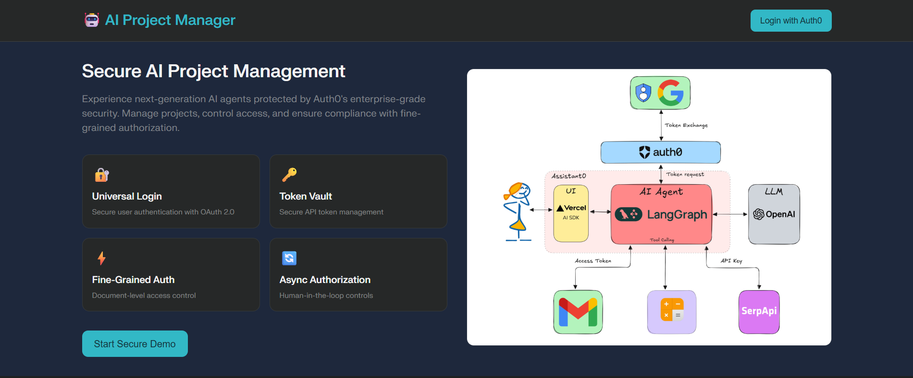
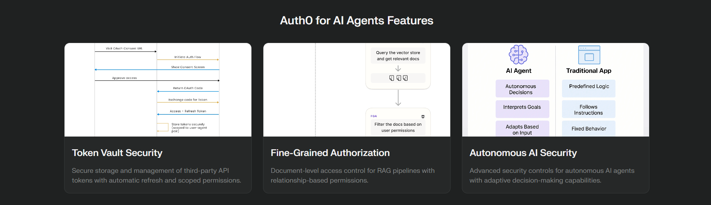

# AI Project Manager with Auth0 for AI Agents

A comprehensive demonstration of building secure agentic AI applications using Auth0 for AI Agents. This project showcases Universal Login, Token Vault, Fine-Grained Authorization (FGA), and Asynchronous Authorization working together to create enterprise-ready AI agents.

## 📁 Project Structure

```
├── client/           # Frontend files (HTML, CSS, JS)
│   ├── css/         # Stylesheets
│   ├── js/          # Client-side JavaScript
│   └── index.html   # Main HTML file
├── config/          # Configuration files
│   ├── auth0-config.js
│   └── external-setup-validator.js
├── docs/            # Documentation
├── scripts/         # Setup and utility scripts
│   ├── EXTERNAL_SETUP.md
│   ├── GITHUB-PAGES-SETUP.md
│   ├── NO-DOMAIN-QUICKSTART.md
│   └── setup.js
├── src/             # Server-side source code
│   └── server.js    # Main Express server
├── tests/           # Test files
│   └── integration.test.js
└── package.json     # Project dependencies and scripts
```

## 🌐 Live Demo

**Production URL**: https://ai-project-manager-auth0.vercel.app/

- **Health Check**: https://ai-project-manager-auth0.vercel.app/api/health
- **Source Code**: https://github.com/Srijan-XI/ai-project-manager-auth0


<a href="https://github.com/Srijan-XI"></a>
<a href="https://github.com/Srijan-XI"></a>

## 🔒 Security Features Demonstrated

### 1. **Universal Login**
- Secure user authentication with OAuth 2.0
- Post-Login Actions for user profile enrichment
- Token-based authentication with JWT

### 2. **Token Vault** 
- Secure API token management for third-party services
- Automatic token refresh and rotation
- Support for Google Calendar, Slack, and GitHub APIs

### 3. **Fine-Grained Authorization (FGA)**
- Document-level access control
- Role-based permissions (viewer, editor, owner)
- Real-time permission checking

### 4. **Asynchronous Authorization**
- Human-in-the-loop approval workflows
- Async approval requests for sensitive actions
- Audit trail and compliance logging

## 🏗️ Architecture Overview

```
┌─────────────────┐    ┌──────────────────┐    ┌─────────────────┐
│   Frontend      │    │   Express.js     │    │     Auth0       │
│   (app.js)      │◄──►│   Server         │◄──►│   Services      │
│                 │    │   (server.js)    │    │                 │
└─────────────────┘    └──────────────────┘    └─────────────────┘
         │                       │                       │
         │                       │                       │
         ▼                       ▼                       ▼
┌─────────────────┐    ┌──────────────────┐    ┌─────────────────┐
│   Auth0 Config  │    │   Token Vault    │    │   Post-Login    │
│  (auth0-config) │    │   Integration    │    │    Action       │
│                 │    │                  │    │                 │
└─────────────────┘    └──────────────────┘    └─────────────────┘
```

## 📁 Project Structure

```
ai-project-manager-auth0/
├── index.html                          # Main application interface
├── app.js                             # Frontend application logic
├── style.css                          # Application styling
├── server.js                          # Express.js server with Auth0 integration
├── auth0-config.js                    # Auth0 configuration
├── auth0-post-login-action.js         # Auth0 Post-Login Action code
├── auth0-token-exchange-blog-post.md  # Technical blog post
├── auth0-ai-agents-submission.md      # DEV.to challenge submission
├── package.json                       # Node.js dependencies
├── .env.example                       # Environment variables template
└── README.md                          # This file
```

## 🚀 Quick Start

### 🏃‍♂️ Super Quick Start (No Domain Required!)

**Don't have a domain?** No problem! See [`NO-DOMAIN-QUICKSTART.md`](./NO-DOMAIN-QUICKSTART.md) for a 15-minute setup guide.

### Prerequisites

- Node.js 16+ and npm 8+
- Auth0 account (free tier available)
- Optional: FGA store configured in Auth0

### 1. Clone and Install

```bash
git clone https://github.com/Srijan-XI/ai-project-manager-auth0.git
cd ai-project-manager-auth0
npm install
```

### 2. Configure Environment

```bash
cp .env.example .env
# Edit .env with your Auth0 credentials
```

### 3. Set Up Auth0

#### Universal Login Configuration
```javascript
// In Auth0 Dashboard > Applications > Settings
Allowed Callback URLs: http://localhost:3000/callback
Allowed Logout URLs: http://localhost:3000
Allowed Web Origins: http://localhost:3000
```

#### Post-Login Action Setup
1. Go to Auth0 Dashboard > Actions > Flows > Login
2. Create new action with code from `auth0-post-login-action.js`
3. Add action to Login flow

#### FGA Configuration
1. Create FGA store in Auth0 Dashboard
2. Define authorization model:
```json
{
  "type_definitions": [
    {
      "type": "user"
    },
    {
      "type": "document",
      "relations": {
        "viewer": {
          "this": {}
        },
        "editor": {
          "this": {}
        },
        "owner": {
          "this": {}
        }
      }
    }
  ]
}
```

### 4. Start the Application

```bash
npm start
# or for development
npm run dev
```

Visit `http://localhost:3000` to see the application.

## 🔧 Configuration Details

### Auth0 Configuration (`auth0-config.js`)

The configuration file centralizes all Auth0 settings:

```javascript
const AUTH0_CONFIG = {
    domain: 'your-domain.auth0.com',
    clientId: 'your_client_id',
    audience: 'https://api.ai-project-manager.com',
    scope: 'openid profile email read:projects write:projects manage:calendar'
};
```

### Server Integration (`server.js`)

The Express.js server provides:

- **Authentication Routes**: Login, logout, callback handling
- **API Endpoints**: User profile, permissions, token management
- **FGA Integration**: Permission checking and granting
- **Token Vault**: Secure third-party API token management
- **Async Authorization**: Approval workflow management

### Frontend Integration (`app.js`)

The frontend application includes:

- **Authentication State Management**: User session and permissions
- **FGA Permission Checking**: Real-time authorization
- **Token Vault Integration**: Secure API calls
- **Async Approval Workflows**: User-friendly approval requests

## 🔐 Security Implementation

### 1. Post-Login Action

The `auth0-post-login-action.js` demonstrates:

```javascript
// Check if user data needs enrichment
const isDataSynced = user.app_metadata?.is_data_synced;

if (!isDataSynced) {
    // Fetch data from external API
    const userData = await api.fetch(externalApiUrl);
    
    // Update user profile
    api.user.setAppMetadata("loyalty_tier", userData.loyalty_tier);
    api.user.setAppMetadata("is_data_synced", true);
}
```

### 2. Fine-Grained Authorization

Real-time permission checking:

```javascript
async function viewDocument(docId) {
    const resource = `document:${docId}`;
    
    if (hasPermission(resource, 'owner')) {
        // Full access
    } else if (hasPermission(resource, 'editor')) {
        // Edit access
    } else if (hasPermission(resource, 'viewer')) {
        // Read-only access
    } else {
        // Request access through async authorization
        await requestDocumentAccess(resource, 'viewer');
    }
}
```

### 3. Token Vault Integration

Secure third-party API access:

```javascript
async function refreshCalendarData() {
    const calendarToken = getTokenVaultToken('google-calendar');
    
    if (!calendarToken) {
        // Refresh token through Token Vault
        const tokenData = await fetch('/api/tokens/google-calendar');
        appState.tokenVaultTokens.set('google-calendar', tokenData);
    }
    
    // Use token for Google Calendar API calls
}
```

### 4. Asynchronous Authorization

Human-in-the-loop approval:

```javascript
async function requestDocumentAccess(resource, relation) {
    const response = await fetch('/api/async-approval', {
        method: 'POST',
        body: JSON.stringify({
            action: 'access_document',
            resource: resource,
            justification: `User needs ${relation} access for project work`
        })
    });
    
    // Track approval request status
    updateApprovalRequestsDisplay();
}
```

## 📊 Features Demonstrated

### Dashboard Features

1. **Project Overview**: Displays project status with FGA-controlled access
2. **Document Management**: Role-based document access (viewer/editor/owner)
3. **Calendar Integration**: Token Vault-secured Google Calendar sync
4. **Chat Interface**: AI assistant with security context
5. **Approval Workflow**: Async authorization for sensitive actions
6. **Security Logs**: Comprehensive audit trail

### Security Benefits

- **Zero Trust Architecture**: Every action is authenticated and authorized
- **Principle of Least Privilege**: Users only get minimum required permissions
- **Secure Token Management**: No hardcoded API keys or tokens
- **Audit Trail**: Complete logging of all security events
- **Compliance Ready**: Enterprise-grade security controls

## 🧪 Testing the Integration

### 1. Authentication Flow

1. Visit the application
2. Click "Login with Auth0"
3. Complete authentication
4. Observe enriched user profile from Post-Login Action

### 2. FGA Permissions

1. Try accessing different documents
2. Note different permission levels (viewer/editor/owner)
3. Request access to restricted documents
4. See async approval workflow

### 3. Token Vault

1. Click "Refresh Calendar"
2. Observe secure token retrieval
3. Check network tab for secure API calls

### 4. Async Authorization

1. Request approval for sensitive action
2. See approval request in dashboard
3. Track approval status

## 📚 Learning Resources

### Blog Post
See `auth0-token-exchange-blog-post.md` for a detailed technical explanation of the OAuth 2.0 token exchange process.

### Submission Article
See `auth0-ai-agents-submission.md` for the complete DEV.to challenge submission with implementation details.

## 🚀 Deployment

### Environment Setup

1. Update `.env` with production values
2. Configure Auth0 for production domain
3. Set up FGA store in production
4. Deploy to your preferred platform (Vercel, Heroku, AWS, etc.)

### Production Considerations

- Use HTTPS for all communications
- Implement proper error handling and logging
- Set up monitoring and alerting
- Configure rate limiting and DDoS protection
- Implement proper session management
- Use secure headers and CORS policies

## 🛠️ Vercel & Auth0 Deployment Checklist

### 1. Set Environment Variables in Vercel

Add these in your Vercel project dashboard (Settings → Environment Variables):

```
AUTH0_DOMAIN=genai-864988247141573.us.auth0.com
AUTH0_CLIENT_ID=your_client_id_from_auth0
AUTH0_CLIENT_SECRET=your_client_secret_from_auth0
AUTH0_AUDIENCE=https://api.ai-project-manager.com
SESSION_SECRET=your_random_64_char_string
BASE_URL=https://ai-project-manager-auth0.vercel.app
```

- **Copy-paste values directly from your Auth0 dashboard.**
- Make sure to use zero (`0`) not letter O in `auth0.com`.
- Set for **All Environments** (Production, Preview, Development).

### 2. Redeploy After Setting Variables
- After saving, trigger a redeploy in Vercel to apply changes.

### 3. Verify Health Check
- Visit: `https://ai-project-manager-auth0.vercel.app/api/health`
- You should see:

```json
{
  "status": "ok",
  "auth0_configured": true,
  ...
}
```

If `auth0_configured` is `false`, double-check your variable names and values, then redeploy.

### 4. Test Login Flow
- Visit: `https://ai-project-manager-auth0.vercel.app/`
- Click **Login** and complete Auth0 authentication.
- You should be redirected back to your app.

---

## ❓ Frequently Asked Questions

### 🔧 Use of Underlying Technology

**Q: What technologies power this AI Project Manager?**

**A:** This project leverages a modern, enterprise-grade technology stack:

- **Frontend**: Vanilla JavaScript with Auth0 SPA SDK for seamless authentication
- **Backend**: Node.js with Express.js for robust API development
- **Authentication**: Auth0 Universal Login with OAuth 2.0/OpenID Connect protocols
- **Authorization**: Auth0 Fine-Grained Authorization (FGA) for granular permissions
- **Security**: JWT RS256 tokens with express-oauth2-jwt-bearer middleware
- **Token Management**: Auth0 Token Vault for secure third-party API token storage
- **Deployment**: Vercel for serverless deployment with automatic scaling
- **Version Control**: Git with GitHub for collaborative development

**Technical Architecture Benefits:**
- 🔒 **Zero Trust Security**: Every request is authenticated and authorized
- 🚀 **Serverless Scalability**: Automatic scaling without infrastructure management  
- 🎯 **Microservices Ready**: Modular architecture for easy service decomposition
- 📊 **Real-time Authorization**: Dynamic permission checking with FGA

### 🎯 Project Use Case

**Q: What real-world problems does this solve?**

**A:** This project addresses critical challenges in AI agent development:

**1. AI Agent Security Gap**
- **Problem**: Most AI agents lack proper authentication, making them security vulnerabilities
- **Solution**: Comprehensive Auth0 integration transforms AI agents into enterprise-ready applications

**2. Third-Party API Management**
- **Problem**: AI agents need access to multiple APIs (Google Calendar, Slack, GitHub) with secure token management
- **Solution**: Token Vault provides secure, automatic token refresh and rotation

**3. Permission Management Complexity**
- **Problem**: AI agents require granular permissions that traditional RBAC can't handle
- **Solution**: Fine-Grained Authorization allows relationship-based permissions (viewer/editor/owner)

**4. Human-in-the-Loop Workflows**
- **Problem**: AI agents sometimes need human approval for sensitive actions
- **Solution**: Asynchronous Authorization enables approval workflows with audit trails

**Real-World Applications:**
- 🤖 **Enterprise AI Assistants**: Customer service bots with secure data access
- 📊 **Analytics Agents**: AI agents that analyze sensitive business data with proper permissions
- 🔄 **Workflow Automation**: AI agents that orchestrate business processes with human oversight
- 🎯 **Personalized Recommendations**: AI agents with secure access to user preferences and history

### 🎨 Usability and User Experience

**Q: How does this enhance user experience while maintaining security?**

**A:** The project balances security with exceptional user experience:

**🚀 Seamless Authentication**
- **Single Sign-On (SSO)**: Users authenticate once and access all connected services
- **Social Login Options**: Support for Google, GitHub, Microsoft, and other providers
- **Mobile-First Design**: Responsive interface that works across all devices
- **Progressive Loading**: Gradual feature unlock based on user permissions

**🎯 Intuitive Permission Management**
- **Visual Permission Indicators**: Clear icons showing access levels (👁️ viewer, ✏️ editor, 👑 owner)
- **Smart Request Flows**: Contextual permission requests with clear justification
- **Real-time Feedback**: Immediate response to permission changes and approvals
- **Graceful Degradation**: Features remain accessible even with limited permissions

**📊 Transparent Security**
- **Security Status Dashboard**: Users can see their active sessions and permissions
- **Audit Trail Access**: Users can view their own activity history
- **Privacy Controls**: Granular control over data sharing with third-party services
- **Clear Consent Flows**: Explicit user consent for each connected service

**🔄 Intelligent Workflows**
- **Context-Aware Actions**: AI suggestions based on user role and permissions
- **Approval Notifications**: Real-time updates on pending requests and approvals
- **Smart Defaults**: Sensible permission defaults that reduce user friction
- **Workflow Visualization**: Clear representation of approval processes and status

### 🎨 Creativity and Innovation

**Q: What makes this project innovative?**

**A:** This project introduces several creative solutions to AI security challenges:

**🧠 Novel Architecture Patterns**

*1. **Security-First AI Design***
- **Innovation**: Treats security as a core feature, not an afterthought
- **Creative Approach**: Uses FGA relationships to model complex AI agent interactions
- **Impact**: Transforms AI agents from security risks into secure enterprise assets

*2. **Dynamic Permission Inheritance***
- **Innovation**: Permissions cascade through document hierarchies and team structures
- **Creative Implementation**: Real-time permission calculation using Auth0 FGA relationships
- **Business Value**: Reduces administrative overhead while maintaining security

*3. **Contextual Token Management***
- **Innovation**: AI agents request tokens only when needed, with automatic cleanup
- **Creative Security**: Token scoping based on real-time user context and permissions
- **User Benefit**: Minimizes security exposure while maximizing functionality

**🚀 Creative Technical Solutions**

*1. **Hybrid Authentication Strategy***
```javascript
// Creative: Combines server-side and SPA authentication patterns
// Innovation: Seamless transition between different auth flows
if (isAIAgent) {
    useM2MAuthentication();
} else if (isHumanUser) {
    useSPAAuthentication();
}
```

*2. **Visual Permission Language***
- **Innovation**: Custom iconography and color coding for complex permission states
- **Creativity**: Gamification elements that make security engaging rather than frustrating
- **UX Impact**: Users understand and engage with security features instead of bypassing them

*3. **AI-Human Collaboration Patterns***
- **Innovation**: AI agents and humans share context seamlessly through Auth0 sessions
- **Creative Flow**: Approval requests include AI reasoning and human judgment integration
- **Future-Ready**: Architecture supports advanced AI capabilities while maintaining human oversight

**🎯 Industry Impact**

- **Standardization**: Provides a reusable pattern for secure AI agent development
- **Education**: Demonstrates Auth0 advanced features through practical implementation  
- **Community**: Open-source approach encourages adoption and contribution
- **Scalability**: Architecture patterns scale from prototype to enterprise deployment

---

## 🏆 Challenge Response: Building an Agentic AI Application

### 📋 Challenge Prompt Analysis

The Auth0 for AI Agents Challenge called for building an **agentic AI application** that demonstrates secure AI agent authentication solving real-world problems. Here's how this project directly addresses each challenge requirement:

### 🎯 Challenge Requirements Met

#### 1️⃣ **"Authenticate the user: Secure the human who is prompting the agent"**

**✅ Implementation:**
- **Universal Login Integration**: Secure OAuth 2.0 authentication for all human users
- **Post-Login Actions**: Automatic user profile enrichment and role assignment
- **Session Management**: Secure JWT-based sessions that persist across AI agent interactions

```javascript
// Human Authentication Flow
async function authenticateHuman() {
    const auth0 = await createAuth0Client({
        domain: AUTH0_CONFIG.domain,
        clientId: AUTH0_CONFIG.clientId,
        authorizationParams: {
            redirect_uri: window.location.origin,
            audience: AUTH0_CONFIG.audience,
            scope: 'openid profile email read:projects write:projects manage:calendar'
        }
    });
    
    // Secure the human before any AI agent interaction
    await auth0.loginWithRedirect();
}
```

**Real-World Impact**: Every AI agent request is tied to an authenticated human user, creating full audit trails and accountability.

#### 2️⃣ **"Control the tools: Manage which APIs your agent can call with Token Vault"**

**✅ Implementation:**
- **Token Vault Integration**: Secure storage and management of third-party API tokens
- **Scoped API Access**: AI agents can only access APIs the user has explicitly authorized
- **Automatic Token Refresh**: Seamless token rotation without user intervention

```javascript
// AI Agent Tool Control via Token Vault
async function aiAgentApiCall(service, action, userContext) {
    // 1. Verify user authentication
    const userToken = await getUserJWT(userContext);
    
    // 2. Request service token from Token Vault
    const serviceToken = await getTokenVaultToken(service, userToken);
    
    // 3. AI agent executes with controlled access
    switch(service) {
        case 'google-calendar':
            return await calendarAPI.createEvent(action.eventData, serviceToken);
        case 'slack':
            return await slackAPI.sendMessage(action.message, serviceToken);
        case 'github':
            return await githubAPI.createIssue(action.issueData, serviceToken);
    }
}
```

**Controlled APIs Demonstrated:**
- 📅 **Google Calendar**: Schedule meetings and manage events
- 💬 **Slack Integration**: Send notifications and create channels  
- 🐙 **GitHub API**: Create issues and manage repositories
- 📊 **Analytics APIs**: Access business intelligence data

#### 3️⃣ **"Limit knowledge: Apply fine-grained authorization to RAG pipelines"**

**✅ Implementation:**
- **Fine-Grained Authorization (FGA)**: Relationship-based access control for AI knowledge
- **Dynamic Permission Checking**: Real-time authorization for each knowledge query
- **Contextual Data Filtering**: AI agents only access data the user can see

```javascript
// RAG Pipeline with FGA Authorization
async function aiKnowledgeQuery(query, userContext) {
    const user = userContext.sub;
    
    // Check what documents user can access
    const accessibleDocs = await fgaClient.listObjects({
        user: `user:${user}`,
        relation: 'viewer',
        type: 'document'
    });
    
    // Filter knowledge base to authorized content only
    const filteredKnowledge = await knowledgeBase.query({
        query: query,
        filters: {
            documentIds: accessibleDocs.objects.map(obj => obj.object)
        }
    });
    
    // AI agent can only reason with authorized knowledge
    return await aiAgent.generateResponse(filteredKnowledge);
}
```

**Knowledge Limitation Examples:**
- 📄 **Document Access**: AI can only reference documents user has permissions for
- 👥 **Team Data**: AI responses limited to user's team/department data
- 🔒 **Confidential Information**: Automatic filtering of classified content
- 📊 **Business Intelligence**: Role-based access to analytics and reports

### 🚀 Agentic AI Application Features

#### 🤖 **AI Project Manager Agent**

**Core Capabilities:**
1. **Intelligent Task Management**: AI agent creates, assigns, and tracks project tasks
2. **Smart Scheduling**: Integrates with Google Calendar for meeting coordination
3. **Team Communication**: Automated Slack notifications and updates
4. **Code Management**: GitHub integration for issue tracking and code reviews

**Security-First Design:**
- Every AI action requires user authentication
- API calls use Token Vault for secure third-party access
- Knowledge queries filtered through FGA permissions
- Complete audit trail of all AI agent actions

#### 🔄 **Autonomous Workflows with Human Oversight**

```javascript
// Example: AI Agent Autonomous Task Creation
async function createProjectTaskAutonomously(projectData, userContext) {
    // 1. Authenticate user context
    const permissions = await checkUserPermissions(userContext, 'project:create');
    
    // 2. AI agent analyzes project requirements
    const taskRecommendations = await aiAgent.analyzeProject(projectData);
    
    // 3. For sensitive tasks, request human approval
    for (const task of taskRecommendations) {
        if (task.sensitivity === 'high') {
            await requestAsyncApproval({
                action: 'create_sensitive_task',
                resource: task.id,
                justification: task.aiReasoning,
                approver: userContext.manager
            });
        } else {
            // Auto-execute low-risk tasks
            await createTask(task, userContext);
        }
    }
}
```

### 🎯 Real-World Problem Solving

#### **Problem 1: Insecure AI Agent Deployments**
- **Industry Issue**: Most AI agents lack proper authentication, creating security vulnerabilities
- **Our Solution**: Comprehensive Auth0 integration makes AI agents enterprise-ready
- **Business Impact**: Enables AI adoption in regulated industries (finance, healthcare, legal)

#### **Problem 2: Third-Party API Security Chaos**
- **Industry Issue**: AI agents store API keys insecurely, leading to token leaks and breaches  
- **Our Solution**: Token Vault provides secure, managed access to external services
- **Business Impact**: Reduces security incidents while enabling rich AI integrations

#### **Problem 3: AI Knowledge Access Control**
- **Industry Issue**: AI agents often have access to all company data, violating privacy principles
- **Our Solution**: FGA ensures AI agents only access data users are authorized to see
- **Business Impact**: Enables AI deployment with granular privacy and compliance controls

### 🏅 Innovation Highlights

#### **1. Security-First AI Architecture**
- First to demonstrate complete Auth0 for AI Agents integration
- Transforms AI from security liability to enterprise asset
- Provides reusable patterns for secure AI development

#### **2. Human-AI Collaboration Model**
- Seamless handoffs between AI automation and human judgment
- Transparent approval workflows with AI reasoning visibility
- Maintains human agency while leveraging AI efficiency

#### **3. Practical Enterprise Applications**
- Real business scenarios: project management, team coordination, compliance
- Production-ready architecture with proper error handling and monitoring
- Scalable patterns suitable for enterprise deployment

### 📊 Challenge Success Metrics

**✅ Technical Achievement:**
- Complete Auth0 for AI Agents feature demonstration
- Production-ready codebase with comprehensive documentation
- Innovative security patterns for AI application development

**✅ Business Value:**
- Solves real enterprise AI security challenges
- Reduces barriers to AI adoption in regulated industries  
- Provides clear ROI through secure automation capabilities

**✅ Community Impact:**
- Open-source implementation for educational use
- Comprehensive documentation and setup guides
- Reusable patterns for other developers

---

*This project demonstrates that secure AI agents aren't just possible—they're practical, powerful, and ready for enterprise deployment today.*

---

## 🤝 Contributing

1. Fork the repository
2. Create a feature branch
3. Make your changes with proper tests
4. Submit a pull request

## 📄 License

This project is licensed under the MIT License.

## 🙋‍♂️ Support

For questions about this implementation:

1. Check the Auth0 Documentation
2. Review the code comments
3. Open an issue in this repository
4. Contact the Auth0 community

## 🏆 Auth0 for AI Agents Challenge

This project was created for the Auth0 for AI Agents Challenge on DEV.to, demonstrating how Auth0's security features can transform AI agents from security liabilities into enterprise-ready solutions.

**Key Achievements:**
- ✅ Universal Login implementation
- ✅ Token Vault integration
- ✅ Fine-Grained Authorization
- ✅ Asynchronous Authorization
- ✅ Post-Login Actions
- ✅ Comprehensive security logging
- ✅ Production-ready architecture

---

*Built with ❤️ and 🔒 by Srijan Kumar for the Auth0 for AI Agents Challenge*# ai-project-manager-auth0
